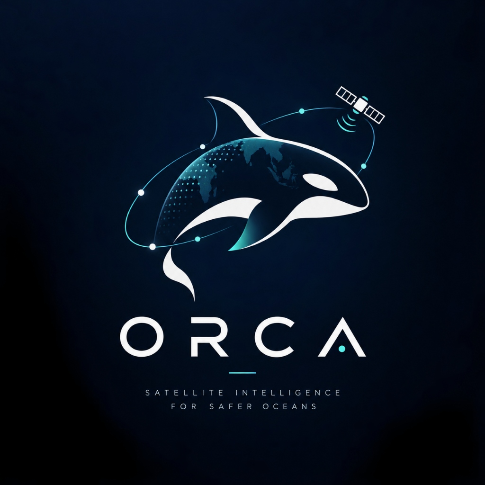
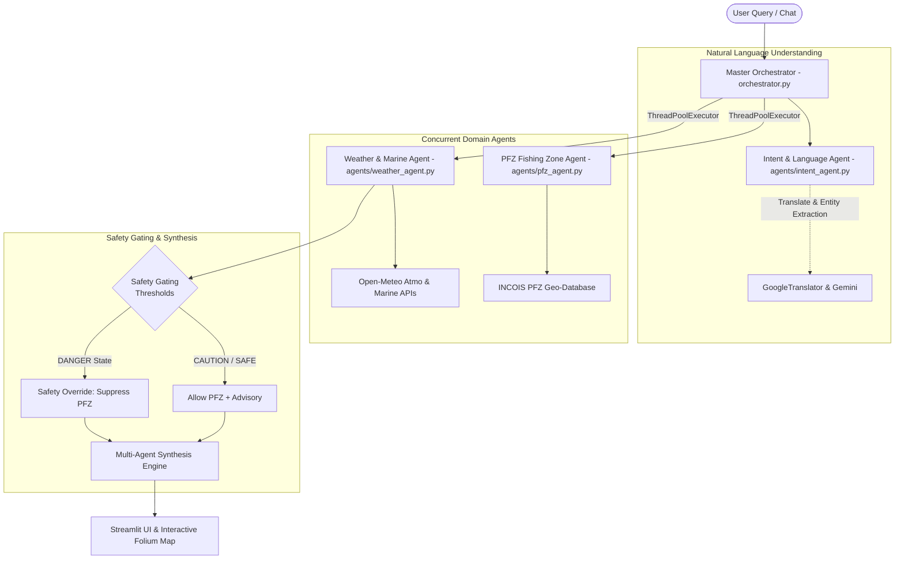

<p align="center">
  
</p>

# 🌊 ORCA — Satellite Intelligence for Safer Oceans
*Marine EcoSystem Reasoning with Collaborative Agents*

[](https://www.python.org/)
[](https://streamlit.io/)
[](https://aistudio.google.com/)
[](LICENSE)

> **ISRO SIH Problem Statement ID 26176**  
> **Theme:** Disaster Management / Coastal & Marine Ecosystem Intelligence  
> **Department:** Department of Space / Indian Space Research Organisation (ISRO)

---

## 📌 Executive Summary

**ORCA** is an autonomous, multi-agent AI system designed to empower coastal authorities, researchers, and traditional fishing communities. ORCA ingests real-time oceanographic and meteorological data, reasons across domain-specific criteria (IMD/INCOIS guidelines), and provides actionable safety and productivity recommendations through interactive maps and multilingual interfaces.

---

## 🏛️ System Architecture

ORCA employs a lightweight, transparent multi-agent architecture where every component conforms to the uniform interface contract:
```python
run(inputs: dict) -> dict
```



---

## 🌟 Key Features

1. **🧠 Intent & Multilingual Intelligence (`agents/intent_agent.py`)**
   - Detects input language (English, Hindi, Tamil, Telugu, Malayalam, Bengali, etc.).
   - Normalizes queries via `deep-translator` for accurate rule-based entity recognition and intent classification.
   - Preserves user language for personalized responses.

2. **🌦️ Real-Time Oceanographic Forecasts (`agents/weather_agent.py`)**
   - Fetches live atmospheric and sea state forecasts from Open-Meteo.
   - Assesses wind speeds, gusts, wave heights, swell, wave periods, precipitation, and thunderstorms against IMD/INCOIS maritime safety criteria.
   - Evaluates rule-based baseline verdicts (`SAFE`, `CAUTION`, `DANGER`) verified by Gemini.

3. **🐟 Potential Fishing Zone (PFZ) Advisories (`agents/pfz_agent.py` & `tools/pfz_tools.py`)**
   - INCOIS-modeled geo-database of 21+ major fishing zones spanning India's entire coastline (Gujarat, Maharashtra, Goa, Karnataka, Kerala, Tamil Nadu, Andhra Pradesh, Odisha, West Bengal, Andaman & Nicobar).
   - Real-time Haversine nearest-zone queries reporting distance, depth, quality, target species, and seasonal recommendations.

4. **🛡️ Maritime Safety Gating (`orchestrator.py`)**
   - **`DANGER` Override:** When gale winds, high waves (>2.5m), or thunderstorms threaten a region, PFZ recommendations are **strictly suppressed** (`pfz_result = None`), preventing hazardous maritime operations.
   - **`CAUTION` Guidance:** Issues warnings for elevated sea conditions while identifying safe corridors.

5. **🗺️ Interactive Folium Mapping (`tools/map_tools.py`)**
   - Uses OpenStreetMap tiles (no watermarks or keys required).
   - Visualizes the boat/port coordinates, safety perimeter circle colored by weather risk, and clickable PFZ hotspot pins with detailed popups.

---

## 📂 Project Structure

```
orca/
├── agents/
│   ├── intent_agent.py        # Language detection & intent classification
│   ├── weather_agent.py       # Atmospheric & marine conditions reasoning
│   └── pfz_agent.py           # Potential Fishing Zone locator & advisories
├── tools/
│   ├── weather_tools.py       # Nominatim geocoding & Open-Meteo API fetchers
│   ├── pfz_tools.py           # PFZ database (21+ zones) & spatial Haversine calculator
│   └── map_tools.py           # Folium interactive map generator (OpenStreetMap)
├── tests/
│   ├── test_weather_agent.py  # Weather agent unit and live tests
│   └── test_orchestrator.py   # Multi-agent unit tests & live integration tests
├── orchestrator.py            # Master multi-agent orchestrator & safety gating
├── app.py                     # Streamlit chat interface & map renderer
├── config.py                  # Environment config & model definitions
├── requirements.txt           # Python dependencies
├── .env.example               # Template for API keys
└── README.md
```

---

## 🚀 Getting Started

### 1. Prerequisites
- Python 3.10 or higher
- A free Google Gemini API key from [Google AI Studio](https://aistudio.google.com/)

### 2. Clone the Repository
```bash
git clone https://github.com/abhimanyu-kotari/Orca.git
cd Orca
```

### 3. Set Up Virtual Environment
```bash
# Windows
python -m venv venv
.\venv\Scripts\activate

# Linux / macOS
python3 -m venv venv
source venv/bin/activate
```

### 4. Install Dependencies
```bash
pip install -r requirements.txt
```

### 5. Configure Environment Variables
Create a `.env` file in the project root:
```env
GEMINI_API_KEY="your_gemini_api_key_here"
```

---

## 🧪 Running Tests

Verify orchestration, unit safety gating, and agent logic:
```bash
# Run unit tests (no network calls, executes in <1s)
python -m unittest tests.test_orchestrator.TestOrchestratorUnit

# Run all orchestrator tests (including live network calls)
python tests/test_orchestrator.py
```

---

## 💻 Running the Application

Launch the Streamlit dashboard:
```bash
streamlit run app.py
```

Open `http://localhost:8501` in your browser.

### Sample Queries to Try:
- **English:** *"Is it safe to go fishing near Rameswaram tomorrow?"*
- **PFZ Query:** *"Where can I fish near Kochi today?"*
- **Hindi:** *"मुंबई के पास मछली कहाँ पकड़ें?"*
- **Tamil:** *"ராமேஸ்வரம் அருகே மீன்பிடிக்க எங்கே போவது?"*
- **Direct Controls:** Use the sidebar to inspect specific port coordinates and trigger manual weather checks or PFZ searches.

---

## 👥 Contributors

- **Abhimanyu Kotari** — Lead Developer & Architecture

---

## 📜 License

This project is licensed under the MIT License.
